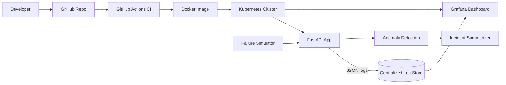

# System Architecture — ai-log-anomaly-devops

**GitHub Issue:** #2 System architecture
**Phase:** PLAN

## High-Level Flow

```
 Developers → GitHub (Code) → GitHub Actions CI (Build/Test) → Docker Image
                                                                      │
                                                              Kubernetes Cluster
                                                                      │
        ┌─────────────────────────────────────────────────────────────┤
        │                                                             │
   FastAPI App (api) ──JSON logs──► Centralized Log Store (Loki/ELK) │
        │                                   │                        │
   Anomaly Detection Engine                ▼                        │
        │                            Grafana Dashboard ◄── Metrics   │
   AI Incident Summarizer                                            │
        │                                                            │
   Failure Simulator (test traffic) ─────────────────────────────────┘
```

## Components

1. **FastAPI Application** — REST API: `/health`, `POST /logs`, `GET /anomalies`, `GET /incidents/{id}`. Emits structured JSON logs.
2. **Anomaly Detection Engine** — scans ingested logs; rules (error-rate threshold) + z-score on log volume; tags anomalies.
3. **Incident Summarizer** — groups correlated anomalies into a single incident with an AI-generated (or templated) summary.
4. **Centralized Logging** — container stdout → Promtail/Filebeat → Loki/Elasticsearch for aggregation & query.
5. **Monitoring Dashboard** — Grafana panels: log volume, error rate, anomaly count, pod health.
6. **Failure Simulator** — endpoint/script that floods synthetic error logs to validate detection end-to-end.

## DevOps Lifecycle Mapping

| Stage | Artifact |
|-------|----------|
| Plan | requirements.md, this diagram, Issues #1–#15, Project board |
| Code | FastAPI app + structured logging (Issues #3, #4) |
| Build | Dockerfile (Issue #5) |
| Test | pytest suite (Issue #6) |
| Release | CI pipeline (Issue #7) |
| Deploy | Kubernetes manifests (Issue #8) |
| Operate | Centralized logging (Issue #9) |
| Monitor | Dashboard + anomaly/incident features (Issues #10–#12) |
| Validate | Failure simulation + E2E tests (Issues #13, #14) |

## Exporting architecture.png

Option A — Mermaid Live Editor: paste the mermaid block below into
https://mermaid.live and export as PNG to `architecture.png` at repo root.

Option B — CLI: `npx -y @mermaid-js/mermaid-cli -i docs/architecture.mmd -o architecture.png`


